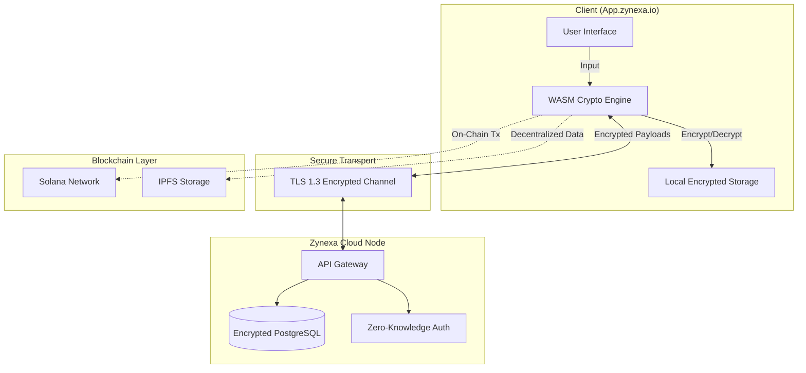

# Zynexa Core

**Zynexa** is a privacy-first digital operating system for the decentralized web. Built on advanced cryptography and zero-knowledge principles, it empowers individuals with complete sovereignty over their digital identity, communication, and assets.

## 🔗 Official Links

| Resource | URL |
|----------|-----|
| **Website** | [zynexa.io](https://zynexa.io) |
| **App** | [app.zynexa.io](https://app.zynexa.io) |
| **Documentation** | [docs.zynexa.io](https://docs.zynexa.io) |
| **About** | [about.zynexa.io](https://about.zynexa.io) |
| **X (Twitter)** | [x.com/zynexa](https://x.com/zynexa) |

## 🏗 Architecture

Zynexa utilizes a client-side encryption model where the server acts merely as a blind relay and storage provider. User keys never leave the client device.

## 🛡 Security Core

*   **End-to-End Encryption**: AES-256-GCM and X3DH key exchange.
*   **Zero-Knowledge Architecture**: The server knows nothing about the data it stores.
*   **Non-Custodial**: Private keys are generated and stored locally using Web Crypto API.
*   **Ed25519 Signatures**: Identity verification without exposing secrets.

## ⚡ Technology Stack

| Component | Technology | Description |
|-----------|------------|-------------|
| **Frontend** | React 18, Tailwind, Shadcn | High-performance, accessible UI |
| **Cryptography** | TweetNaCl, BIP39, Web Crypto | Military-grade encryption in browser |
| **Backend** | Node.js, Express | High-throughput API gateway |
| **Database** | PostgreSQL (Neon) | Scalable relational storage |
| **ORM** | Drizzle | Type-safe database interactions |
| **Blockchain** | Solana Web3.js | High-speed, low-cost transactions |

## 🗺 Roadmap

### Foundation (100% - Completed)
- ✅ Zero-Knowledge Identity System
- ✅ PostgreSQL Database Infrastructure
- ✅ Landing Pages & Branding
- ✅ Solana Blockchain Integration

### Core Features (100% - Completed)
- ✅ End-to-End Encrypted Messaging (Signal Protocol)
- ✅ Private Drive Storage (IPFS Encrypted)
- ✅ Stealth Swap Integration (MEV Protection)
- ✅ User Dashboard Enhancement

### Platform Expansion (Planned)
- [ ] Mobile Applications (iOS & Android)
- [ ] Browser Extension (Chrome/Firefox)
- [ ] Progressive Web App (Offline Support)
- [ ] Security Audit (Third-party Review)

### Developer Ecosystem (Planned)
- [ ] Public API Release
- [ ] JavaScript SDK
- [ ] Developer Documentation
- [ ] Webhook System

### Mainnet & Governance (In Progress - 25%)
- ✅ Solana Mainnet Deployment
- [ ] ZYNX Token Launch
- [ ] DAO Governance
- [ ] Enterprise Solutions

### Multi-Chain & Scale (Planned)
- [ ] Ethereum Integration
- [ ] Multi-Chain Identity
- [ ] Advanced DeFi Features
- [ ] Global Partnerships

## 📄 License

This project is licensed under the MIT License - see the [LICENSE](LICENSE) file for details.

---

*Built with ❤️ by Zynexa Labs*
